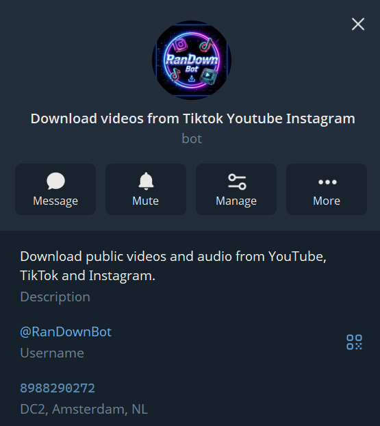
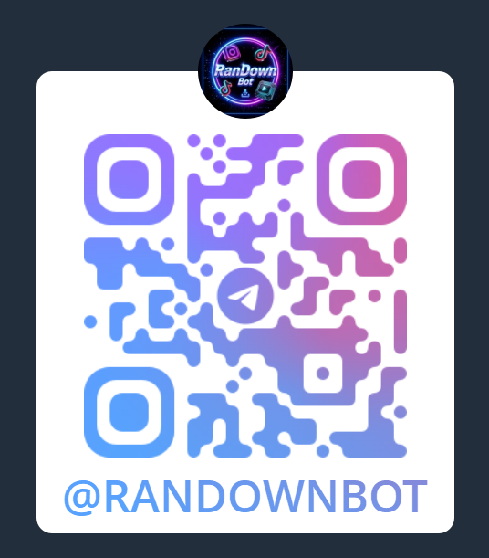
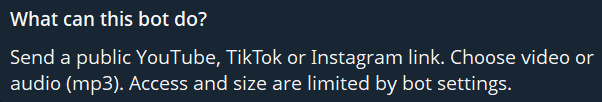

# RanDownBot
RanDownBot

Telegram bot: downloads videos and audio from YouTube, TikTok and Instagram

[LINK](https://t.me/RanDownBot)

## Features

- Download YouTube, TikTok, Instagram videos
- Download MP4 or MP3.
- Queue 1 simultaneous download, with progress, cancellation and send as file actions.
- Paste or drag URLs.
- Limits:50 mb max file size, 15 min max duration, 20 requests per day.
- Available 3 languages: Kazakh, English, Russian.
- Without saving any your data, include URLs and texts.\

## Screenshots

These previews are labelled placeholders, not application captures. Replace them with the PNG files in the [screenshot checklist](docs/images/README.md), then update these image links.

| View | Placeholder | Required real file |
| --- | --- | --- |
| Profile Pictuce |  | `images/pfp.png` |
| Telegram Profile |  | `images/profile.png` |
| QR |  | `images/qr.png` |
| About |  | `images/about.png` |
